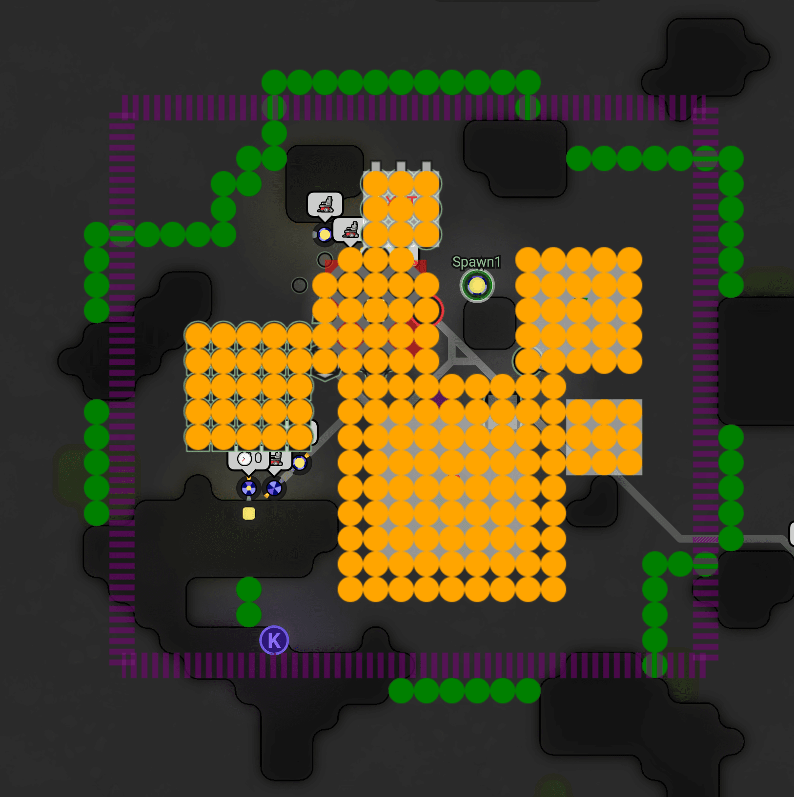

# 建筑自动规划

## 初步思想
1. 根据到达source、controller、mineral(?)的距离初步决定房间中心
2. 使用***distanceTransfer***算法算法处理房间terrain图  
3. 将各个建筑块根据DT结果依次置入获得基本建筑的规划结果  
4. 进一步推导出rampart的放置策略

***

## 细节

#### 建筑选择部分:

1. 每一个建筑块选择后可能需要刷新/重新获得DT图，大概率有更好解决策略
2. 建筑块放置顺序目前决定不过分考虑，暂定核心块→ext→tower
3. 建筑快构造，暂定将生产核心建筑全部放在核心块中，ext块采取5个一组的十字型

#### 围墙防守策略

1. 参考自slack玩家**donatzor**:  
    >Scan area is +/- 3 max/min reserved poses x/y vals, loop each pos in area, Pos in scan area, are you 4 away from a reservedPosition? If so, add to wallList  

    

    >Orangey-yellow: 'reserved' by a building' purple is the bounding box (though slightly off I think) and green is the generated walls.  

    由图中可见有部分不必要的rampart生成(mineral旁)，目前认为该部分可用floodfill方法判定并去除【暂时计划
    
***

## 相关参考
1. 内容相关构思  
[Screeps wiki/AutoBuilding](https://wiki.screepspl.us/index.php/Automatic_base_building)  
[slack #automation](https://app.slack.com/client/T0HJCPP9T/C1LD2S0AU)  
2. 相关可用算法：  
distanceTrancefer,floodfill,mincut
***